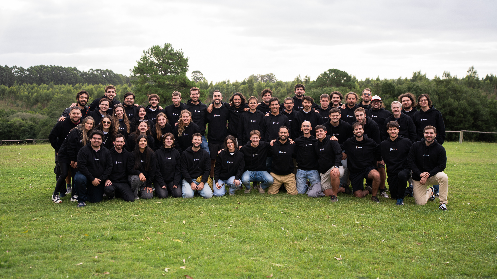

# Getting Started

Welcome to the team!



## Prerequisites

- Git
- Node.js 22+ (via nvm recommended)
- Yarn 4.x
- Docker
- PostgreSQL 16+

## Clone the Repositories

```bash
git clone git@github.com:liafocus/<project>.git
cd <project>
yarn install
```

## Environment Variables

Create a `.env` file or export the following variables:

```bash
export POSTGRES_HOST=127.0.0.1
export POSTGRES_PORT=5432
export POSTGRES_USER=postgres
export POSTGRES_PASSWORD=<your-password>
```

## Running Locally

```bash
yarn dev
```

The application will be available at `http://localhost:3000`.
